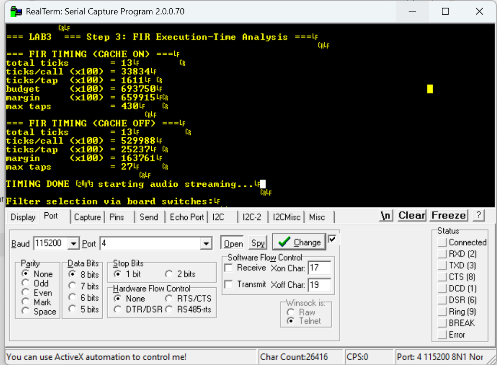

# **Lab 3 – AD/DA Conversion and Audio Processing**

This repository contains the full implementation of **Lab 3** for the
Advanced Embedded Systems course (University of Cagliari).
The project acquires audio from the **SSM2603 codec** via I2S, optionally processes the audio stream using a software FIR filter, and transmits the resulting audio back to the DAC for playback on the Zybo Z7 board.

---

<p align="center">
  
</p>
<p align="center"><i>Photo taken during AES Lab</i></p>

---

## **Instructions**

This assignment is related to **Lab 3 on AD/DA conversion and real-time DSP**.
Students must prepare the following implementations:

* **Step 1 – Loopback** (raw passthrough)
* **Step 2 – FIR Filtering** (real-time convolution)
* **Step 3 – FIR Timing Analysis** (Global Timer performance evaluation)

The system must:

1. Acquire audio samples from the **I2S RX FIFO**
2. Process samples according to the selected version:

   * **Loopback**
   * **FIR filtering** (LPF / HPF / aggressive LPF / aggressive HPF)
3. Transmit samples to the **I2S TX FIFO**
4. Playback via **SSM2603 DAC**

---

## **Codec Configuration**
The SSM2603 audio codec is configured via I2C using the XIicPs driver.
Configuration includes clocking, audio format, sampling frequency, and channel enablement.


---

## **Hardware Platform**

The Vivado design includes:

| Peripheral         | Function                                 |
| ------------------ | ---------------------------------------- |
| `ps7_uart_1`       | UART console output                      |
| `ps7_global_timer` | High-resolution performance measurements |
| `axi_gpio`         | Switches / LEDs / Buttons                |
| `axi_i2s_adi_1`    | I2S controller for SSM2603               |
| `axi_fifo_mm_s`    | RX/TX FIFO buffering for audio frames    |

---

## **Project Structure**

```
Lab 3/
│
├── lab3_step1_loopback.c          → Step 1: audio loopback
├── lab3_step2_fir.c               → Step 2: real-time FIR filtering
├── lab3_step3_timing.c            → Step 3: timing and cycles/tap analysis
│
├── AES/                           → Full Xilinx SDK/Vitis workspace
│   ├── lab3_step1_loopback/       → Step 1 SDK project
│   ├── lab3_step2_fir/            → Step 2 SDK project
│   ├── lab3_step3_timing/         → Step 3 SDK project
│   ├── *_bsp/                     → Board Support Packages
│   └── design_1_wrapper_hw_0/     → Hardware platform (.hdf/.xsa)
│
└── README.md                      → Lab documentation
```

**Notes:**

* Folder `AES/` contains the **complete workspace** for compilation and testing.
* The `.c` files in the root are **clean standalone versions** for review and grading.
* All implementations share the same codec initialization and I2S RX/TX logic.

---

## **Implementations Summary**

### 🔹 **(1) Step 1 – Loopback (`lab3_step1_loopback.c`)**

Implements a raw passthrough of audio samples:

1. Initialize the codec (I2C)
2. Configure I2S @ 48 kHz
3. Read Left/Right samples from RX FIFO
4. Immediately write them to TX FIFO (no processing)

### **Sampling Frequency Estimation**

Using the Global Timer:

```c
u32 t = Xil_In32(GLOBAL_TMR_BASEADDR + GTIMER_COUNTER_LOWER_OFFSET);
```

The sampling frequency is computed as:

```
delta_ticks = t[n+1] − t[n]
Fs     = 333e6 / delta_ticks
```

---
Measured Output


<p align="center">
  
</p>
<p align="center"><i>Measured Output: frequency is approximately 47.7 kHz </i></p>


The measured value is slightly lower than the nominal 48 kHz due to:

- Integer clock dividers

- Asynchronous clock domains (PL vs PS)

- Finite timer resolution

The result confirms correct and stable audio subsystem configuration.

---

### 🔹 **(2) Step 2 – FIR Audio Filtering (`lab3_step2_fir.c`)**

Real-time software FIR filtering:

```
y[n] = h0·x[n] + h1·x[n−1] + … + hN·x[n−N]
```

<p align="center">
  
</p>
<p align="center"><i>Conceptual representation of FIR convolution</i></p>

---

**Features:**

* Sliding buffers for past samples (`bufferL[]`, `bufferR[]`)
* Parameterizable number of taps
* Four selectable filters:

  * LPF
  * HPF
  * Aggressive LPF
  * Aggressive HPF

A single filter is selected via GPIO switches.

**Prototype:**

```c
int FIR_filter(int *buffer, float *h, int N);
```


---

#### **Validation with Test Vectors**

The FIR implementation has been validated using the reference test vectors provided with the assignment.

* Input samples are applied sequentially to the FIR filter using a sliding window
* The resulting output sequence is compared against the expected reference output vectors
* Minor discrepancies observed in the initial samples are due to:

  * zero-initialized buffer state (filter transient response)
  * floating-point to integer truncation effects

The overall response, stability, and frequency behavior match the expected results.

Code snippet:
```c
#define FIR_TESTVECTOR_MODE 1   // 1 = run self-test only, 0 = normal real-time

```


---


<p align="center">
  
</p>
<p align="center"><i>Filter selection via board switches</i></p>


---

### 🔹 **(3) Step 3 – FIR Timing (`lab3_step3_timing.c`)**

Analyzes computational cost using the Global Timer:

* Cycles per FIR function call
* Cycles per tap
* Maximum number of taps sustainable at 48 kHz
* Comparison **cache ON vs cache OFF**

Output Example:

<p align="center">  </p> <p align="center"><i>UART output showing FIR execution-time analysis (cache ON / cache OFF)</i></p>

**Result Summary**

The FIR filter meets real-time requirements at **48 kHz** with a wide safety margin.
With **caches enabled**, the execution time per sample is well below the available budget, allowing hundreds of taps in theory.
With **caches disabled**, execution time increases significantly, but real-time operation remains feasible for kernels up to **~25–30 taps**, which covers the filters used in this lab.


---

## **Example Workflow**

1. Connect signal to **LINE IN**
2. Connect headphones to **HPH OUT**
3. Load Step 1 → verify passthrough
4. Load Step 2 → enable filters via switches
5. Load Step 3 → read performance results via UART

---

## **Notes**


* I2S RX/TX uses **blocking operations** for deterministic real-time behavior
* FIR operates **in-place** for efficiency
* Filter coefficients must match selected tap length
* FIR buffers are dimensioned to the maximum tap count to safely support aggressive filters
* Ensure buffers are reset at startup
* UART debug prints must not occur inside timing-critical loops

---


*Developed by Lello Molinario*
