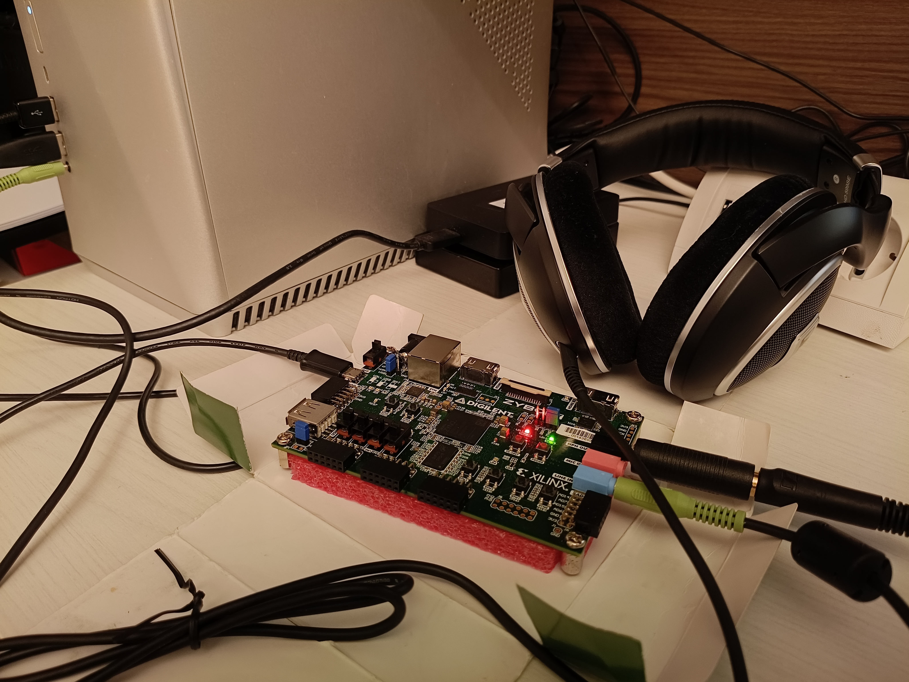
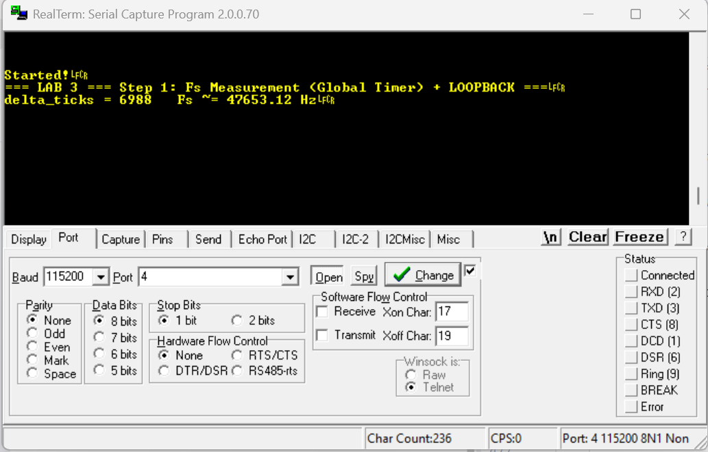
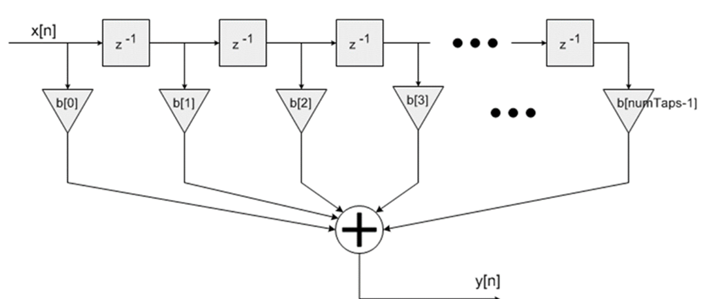
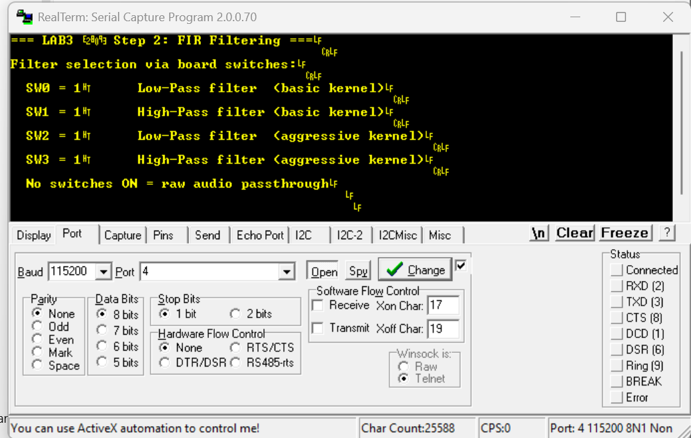
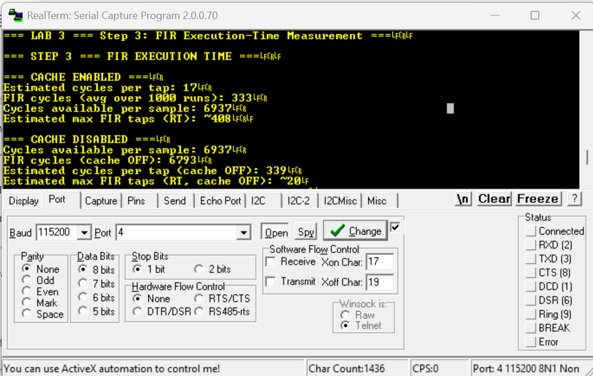

# **Lab 3 – AD/DA Conversion and Audio Processing**

This repository contains the full implementation of **Lab 3** for the
Advanced Embedded Systems course (University of Cagliari).
The project acquires audio from the **SSM2603 codec** via I2S, optionally processes the audio stream using a software FIR filter, and transmits the resulting audio back to the DAC for playback on the Zybo Z7 board.

---

<p align="center">
  
</p>
<p align="center"><i>Photo taken during AES Lab</i></p>

---

## **Instructions**

This assignment is related to **Lab 3 on AD/DA conversion and real-time DSP**.
Students must prepare the following implementations:

* **Step 1 – Loopback** (raw passthrough)
* **Step 2 – FIR Filtering** (real-time convolution)
* **Step 3 – FIR Timing Analysis** (Global Timer performance evaluation)

The system must:

1. Acquire audio samples from the **I2S RX FIFO**
2. Process samples according to the selected version:

   * **Loopback**
   * **FIR filtering** (LPF / HPF / aggressive LPF / aggressive HPF)
3. Transmit samples to the **I2S TX FIFO**
4. Playback via **SSM2603 DAC**

---

## **Codec Configuration**
The SSM2603 audio codec is configured via I2C using the XIicPs driver.
Configuration includes clocking, audio format, sampling frequency, and channel enablement.


---

## **Hardware Platform**

The Vivado design includes:

| Peripheral         | Function                                 |
| ------------------ | ---------------------------------------- |
| `ps7_uart_1`       | UART console output                      |
| `ps7_global_timer` | High-resolution performance measurements |
| `axi_gpio`         | Switches / LEDs / Buttons                |
| `axi_i2s_adi_1`    | I2S controller for SSM2603               |
| `axi_fifo_mm_s`    | RX/TX FIFO buffering for audio frames    |

---

## **Project Structure**

```
Lab 3/
│
├── lab3_step1_loopback.c          → Step 1: audio loopback
├── lab3_step2_fir.c               → Step 2: real-time FIR filtering
├── lab3_step3_timing.c            → Step 3: timing and cycles/tap analysis
│
├── AES/                           → Full Xilinx SDK/Vitis workspace
│   ├── lab3_step1_loopback/       → Step 1 SDK project
│   ├── lab3_step2_fir/            → Step 2 SDK project
│   ├── lab3_step3_timing/         → Step 3 SDK project
│   ├── *_bsp/                     → Board Support Packages
│   └── design_1_wrapper_hw_0/     → Hardware platform (.hdf/.xsa)
│
└── README.md                      → Lab documentation
```

**Notes:**

* Folder `AES/` contains the **complete workspace** for compilation and testing.
* The `.c` files in the root are **clean standalone versions** for review and grading.
* All implementations share the same codec initialization and I2S RX/TX logic.

---

## **Implementations Summary**


### 🔹 **(1) Step 1 – Loopback (`lab3_step1_loopback.c`)**

Implements a raw real-time passthrough of audio samples:

1. Initialize the SSM2603 audio codec via **I²C**
2. Configure the AXI-I2S interface (nominal **48 kHz** sampling rate)
3. Read interleaved **Left / Right** samples from the RX FIFO (blocking)
4. Immediately forward samples to the TX FIFO (**no processing**)

This step validates the complete audio chain:

**ADC → I²S RX → CPU → I²S TX → DAC**

---

### **Sampling Frequency Estimation**

The effective sampling frequency is measured using the **ARM Cortex-A9 Global Timer**, clocked at **CPU/2 = 333 MHz**.

Only the **lower 32 bits** of the Global Timer counter are used:

```c
u32 t = Xil_In32(GLOBAL_TMR_BASEADDR + GTIMER_COUNTER_LOWER_OFFSET);
```

To improve robustness and reduce jitter, the measurement is **averaged over N consecutive sampling periods**.

The procedure is:

```
delta_ticks_avg = ( Σ ( t[n+1] − t[n] ) ) / N
Fs = GLOBAL_TMR_FREQ / delta_ticks_avg
```

where:

* `GLOBAL_TMR_FREQ = 333 MHz`
* `N = 100` samples

UART output is performed **only after the measurement phase**, ensuring that serial I/O does not perturb the timing.

---

### **Measured Output**

```
Fs (avg over 100 samples) ~= 48040.22 Hz
```

<p align="center">
  
</p>
<p align="center"><i>Measured sampling frequency using Global Timer (average over 100 samples)</i></p>

---

### **Discussion**

The measured sampling frequency is **very close to the nominal 48 kHz**, with a deviation of approximately **+0.08%**.

This small discrepancy is expected and can be attributed to:

* Integer clock dividers in the audio clocking chain
* PLL and clock synthesis tolerances
* Finite resolution of the Global Timer
* Minor clock domain interactions between **PL (I²S)** and **PS (CPU)**

The result confirms that the audio subsystem is **correctly configured, stable, and operating at the expected sampling rate**.

---


### 🔹 **(2) Step 2 – FIR Audio Filtering (`lab3_step2_fir.c`)**

Real-time software FIR filtering:

```
y[n] = h0·x[n] + h1·x[n−1] + … + hN·x[n−N]
```

<p align="center">
  
</p>
<p align="center"><i>Conceptual representation of FIR convolution</i></p>

---

**Features:**

* Sliding buffers for past samples (`bufferL[]`, `bufferR[]`)
* Parameterizable number of taps
* Four selectable filters:

  * LPF
  * HPF
  * Aggressive LPF
  * Aggressive HPF

A single filter is selected via GPIO switches.

**Prototype:**

```c
int FIR_filter(int *buffer, float *h, int N);
```


---

#### **Validation with Test Vectors**

The FIR implementation has been validated using the reference test vectors provided with the assignment.

* Input samples are applied sequentially to the FIR filter using a sliding window
* The resulting output sequence is compared against the expected reference output vectors
* Minor discrepancies observed in the initial samples are due to:

  * zero-initialized buffer state (filter transient response)
  * floating-point to integer truncation effects

The overall response, stability, and frequency behavior match the expected results.

Code snippet:
```c
#define FIR_TESTVECTOR_MODE 1   // 1 = run self-test only, 0 = normal real-time

```


---


<p align="center">
  
</p>
<p align="center"><i>Filter selection via board switches</i></p>


---

### 🔹 **(3) Step 3 – FIR Execution-Time Analysis (`lab3_step3_timing.c`)**

This step evaluates the computational cost of the software FIR filter using the
**ARM Cortex-A9 Global Timer**.

The following metrics are measured:

* Execution time of a single `FIR_filter()` call
* Available processing budget per audio sample at **48 kHz**
* Estimated maximum number of FIR taps sustainable in real time
* Impact of **CPU caches enabled vs disabled**

All timing values are expressed in **Global Timer ticks**, running at
**CPU/2 ≈ 333 MHz**.

---

### **Measured Results (Cache Enabled)**

* FIR execution time (single call): **≈ 333 timer ticks**
* Estimated cycles per tap: **≈ 17**
* Available budget per sample: **≈ 6937 timer ticks**
* Estimated maximum FIR taps in real time: **~408 taps**

These results show that the FIR kernels used in this lab (20–29 taps) are
**well within real-time constraints**, with a very large safety margin when
CPU caches are enabled.

---

### **Cache Impact (Worst-Case Execution Time)**

With **instruction and data caches disabled**, the measured execution time
increases significantly:

* FIR execution time (cache OFF): **≈ 6793 timer ticks**
* Estimated cycles per tap (cache OFF): **≈ 339**
* Estimated maximum FIR taps in real time (cache OFF): **~20 taps**

This configuration represents a conservative **worst-case scenario**.
Even under these conditions, all FIR filters implemented in this lab
remain real-time compliant.

---

### **Conclusion**

The execution-time analysis confirms that:

* The FIR implementation comfortably satisfies real-time constraints at 48 kHz
* CPU caches have a **major impact** on FIR performance
* The selected filter lengths (20–29 taps) are safe in both cache-enabled
  and cache-disabled scenarios

---

### Output Example

```text
=== CACHE ENABLED ===
Estimated cycles per tap: 17
FIR cycles (avg over 1000 runs): 333
Cycles available per sample: 6937
Estimated max FIR taps (RT): ~408

=== CACHE DISABLED ===
Cycles available per sample: 6937
FIR cycles (cache OFF): 6793
Estimated cycles per tap (cache OFF): 339
Estimated max FIR taps (RT, cache OFF): ~20
```

<p align="center">
  
</p>
<p align="center"><i>UART output showing FIR execution-time measurement using the Global Timer</i></p>


---

## **Example Workflow**

1. Connect signal to **LINE IN**
2. Connect headphones to **HPH OUT**
3. Load Step 1 → verify passthrough
4. Load Step 2 → enable filters via switches
5. Load Step 3 → read performance results via UART

---

## **Notes**


* I2S RX/TX uses **blocking operations** for deterministic real-time behavior
* FIR operates **in-place** for efficiency
* Filter coefficients must match selected tap length
* FIR buffers are dimensioned to the maximum tap count to safely support aggressive filters
* Ensure buffers are reset at startup
* UART debug prints must not occur inside timing-critical loops

---


*Developed by Lello Molinario*
