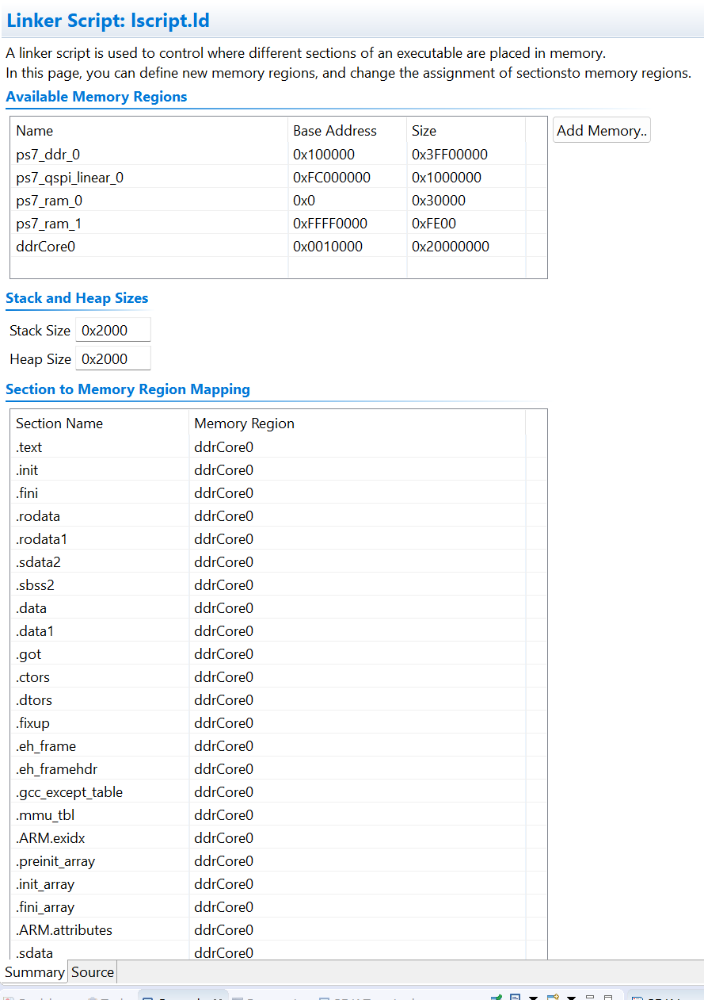
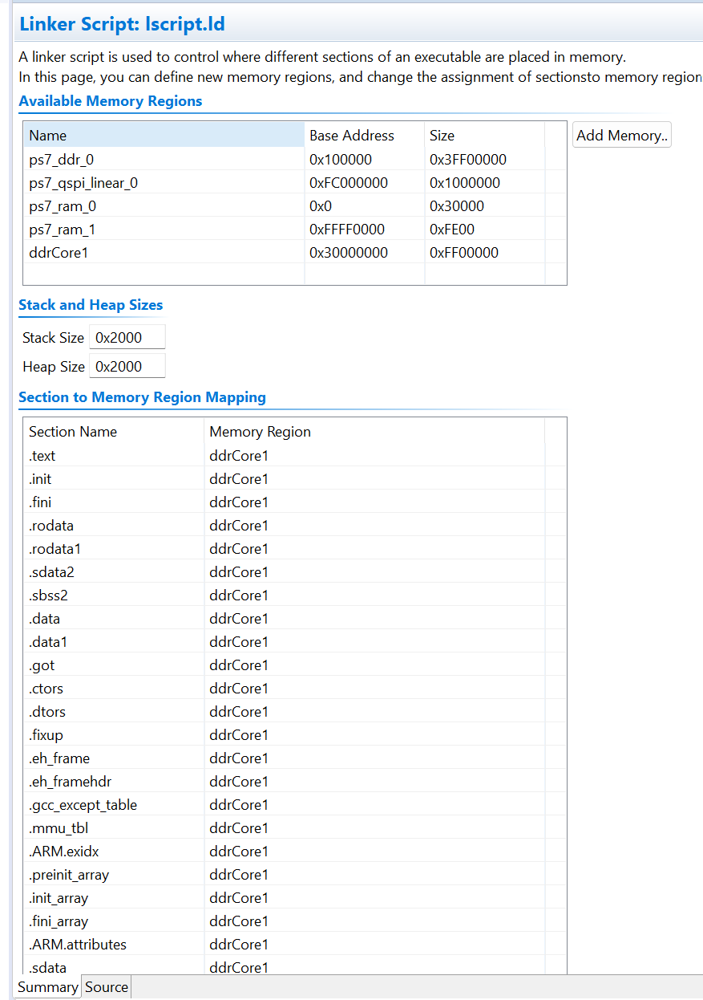

# **Lab 4 – Parallel Processing (Dual-Core Vector Addition)**

---

## **Overview**

This assignment is related to **Lab 4 – Parallel Processing on the Dual-Core ARM Cortex-A9** of the Zybo Z7 board.

The goal is to implement a **shared-memory parallel application** where:

1. Core 0 (**Master**) and Core 1 (**Worker**) cooperate
2. Two input vectors **A** and **B** are stored in DDR shared memory
3. The two cores compute **C = A + B** in parallel
4. Workload is split evenly:

   * Core 0 computes first half
   * Core 1 computes second half
5. Synchronization occurs through simple shared flags (`start`, `done0`, `done1`)
6. Execution time is measured using the **Global Timer**

This lab introduces low-level **multi-core coordination**, **memory sharing**, and **bare-metal synchronization** without OS support.

---

## **Hardware System**

The Vivado hardware platform from previous labs provides:

| Peripheral         | Function                                                   |
| ------------------ | ---------------------------------------------------------- |
| `ps7_cortexa9_0`   | ARM Core 0 (Master)                                        |
| `ps7_cortexa9_1`   | ARM Core 1 (Worker)                                        |
| `ps7_ddr`          | DDR memory used for shared data structures                 |
| `ps7_global_timer` | High-resolution timing (67 MHz × 2 = ~333 MHz timer clock) |
| `axi_gpio`         | Buttons used as start trigger                              |
| `ps7_uart_1`       | UART console for debug output                              |

Both cores access the same DDR memory region, allowing the implementation of parallel computation with explicit synchronization primitives.

---

## **Assignment Structure**

You must produce **two coordinated software applications**:

---

# **Step 1 – Create Two Application Projects**

Create two SDK/Vitis application projects:

* **Master** → Runs on **Cortex-A9 CPU0**
* **Worker** → Runs on **Cortex-A9 CPU1**

Rename the main files:

* `master.c`
* `worker.c`

Both projects must include a shared header:

```
shared.h
```

containing:

* Vector sizes
* Shared memory address
* Shared structure definition (A, B, C, start, done flags)

---

# **Step 2 – Configure Shared Memory in DDR**

Define a shared memory region at a **fixed DDR address**, e.g.:

```
0x2F100000
```

Create the shared structure:

```c
typedef struct {
    u32 A[ARRAY_SIZE];
    u32 B[ARRAY_SIZE];
    u32 C[ARRAY_SIZE];

    volatile u32 start;
    volatile u32 done0;
    volatile u32 done1;
} shared_mem_t;
```

Access the structure via:

```c
#define SHARED ((volatile shared_mem_t *)SHARED_BASE)
```

**Important:**
This region must be **excluded from the linker script** of both applications.

---

# **Step 3 – Implement Parallel Vector Addition**

## **Master (Core 0)**

* Initializes vectors A and B
* Resets synchronization flags
* Waits for button GPIO input
* Writes `start = 1`
* Computes the **first half** of vector C
* Sets `done0 = 1`
* Waits for `done1` from the Worker
* Verifies correctness
* Measures total execution time using the Global Timer

## **Worker (Core 1)**

* Waits for button input (optional)
* Waits until `start == 1`
* Computes the **second half** of vector C
* Sets `done1 = 1`

---

# **Step 4 – Modify Linker Scripts**

Edit `lscript.ld` for **both projects**:

* Ensure no `.text`, `.bss`, `.data`, heap, or stack overlaps the shared DDR region (`0x2F100000`)
* Allow the rest of the code to be placed normally in DDR

This guarantees that memory used for communication is not overwritten by either core.


<p align="center">
  
</p>
<p align="center"><i>Master’s lscript.ld — all sections in ddrCore0, no overlap with shared DDR</i></p>


<p align="center">
  
</p>
<p align="center"><i>Worker’s lscript.ld — all sections in ddrCore1, no overlap with shared DDR</i></p>

---

# **Step 5 – System Debugger Multi-Core Configuration**

Create a **System Debugger** run configuration.

### **Target Setup (must be selected):**

✔ Reset entire system
✔ Program FPGA
✔ Run ps7_init
✔ Run ps7_post_config

### **Application Tab:**

Assign ELF files explicitly:

| Processor | ELF          |
| --------- | ------------ |
| CPU0      | `master.elf` |
| CPU1      | `worker.elf` |

Disable:

❌ Reset processor
❌ Stop at program entry

This allows both cores to run simultaneously from the correct starting point.

---

# **Step 6 – Measure Execution Time with Global Timer**

Use the cycle counter:

```c
u32 t0 = Xil_In32(GLOBAL_TMR_BASEADDR + GTIMER_COUNTER_LOWER_OFFSET);
u32 t1 = Xil_In32(GLOBAL_TMR_BASEADDR + GTIMER_COUNTER_LOWER_OFFSET);
```

Timer frequency:

```
CPU clock ≈ 667 MHz
Global Timer = CPU / 2 ≈ 333 MHz
```

Compute duration:

```
duration_ticks = t1 - t0
duration_seconds = duration_ticks / 333e6
```

Measure the total time required for both cores to compute the full vector.

---


## **Project Structure**

```
Lab4_ParallelProcessing/
│
├── AES/                                → Full Xilinx SDK workspace
│   ├── master/                         → CPU0 application project
│   ├── worker/                         → CPU1 application project
│   ├── *_bsp/                          → Auto-generated BSPs
│   └── design_1_wrapper_hw_platform    → Exported hardware platform
│
├── master.c                            → Core 0: initialization + first half + timing
├── worker.c                            → Core 1: second half + sync
├── shared.h                            → Shared DDR structure and flags
└── README.md                           → Lab documentation (this file)
```

---

## **Implementation Summary**

### 🔹 **Master (Core 0)**

* Setup
* Initialize A and B
* Start Worker
* Compute first half
* Wait for Worker
* Validate
* Print timing

### 🔹 **Worker (Core 1)**

* Wait for start flag
* Compute second half
* Signal completion

### 🔹 **Shared Memory**

* Stable DDR address
* Structure containing all vectors + flags

### 🔹 **Global Timer Measurement**

* High-precision timing
* Used to evaluate performance scaling

---

## **Output Example**

---
<p align="center">
  
</p>
<p align="center"><i>Output produced by both cores running in parallel (Master + Worker)</i></p>

---


## **Notes**

* Caches are disabled by default to avoid coherency issues
* DDR shared memory must be chosen carefully
* Synchronization must be minimal but correct
* The Worker cannot start before the Master sets `start = 1`
* Button GPIO ensures both cores begin after the user triggers execution

---

*Developed by Lello Molinario*
