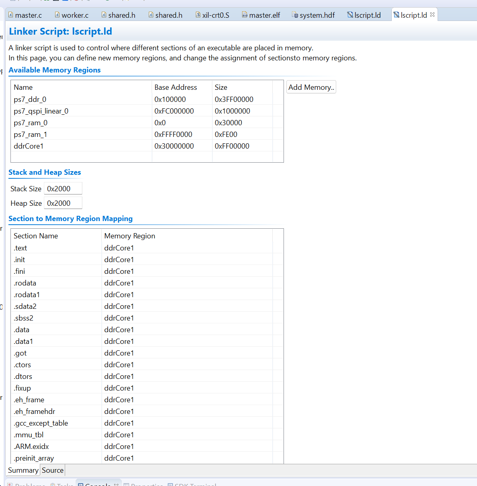
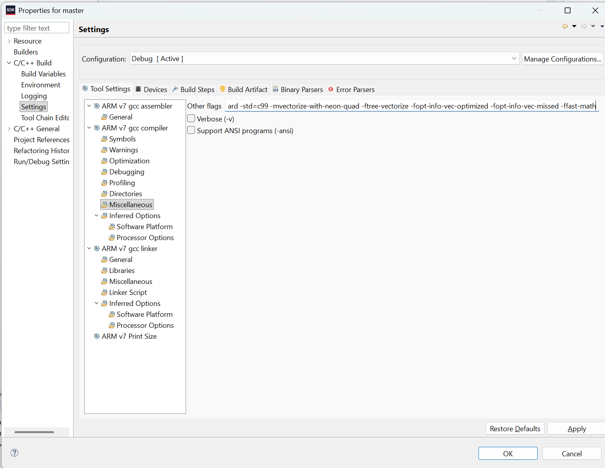
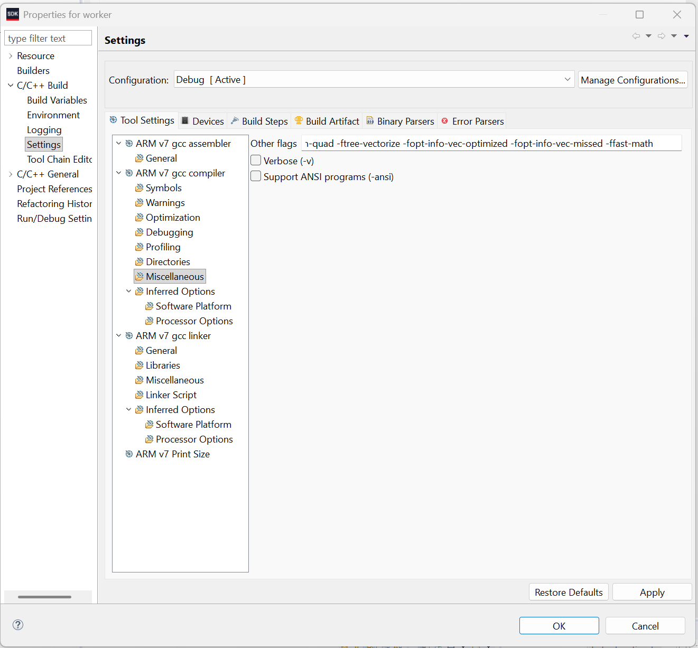
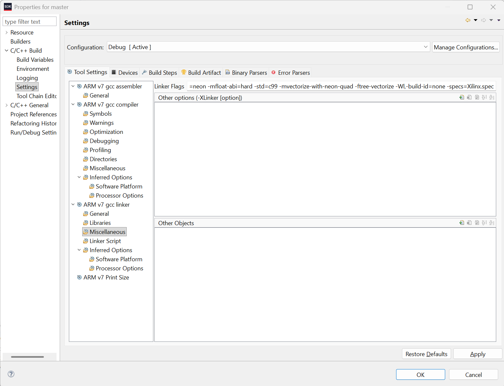
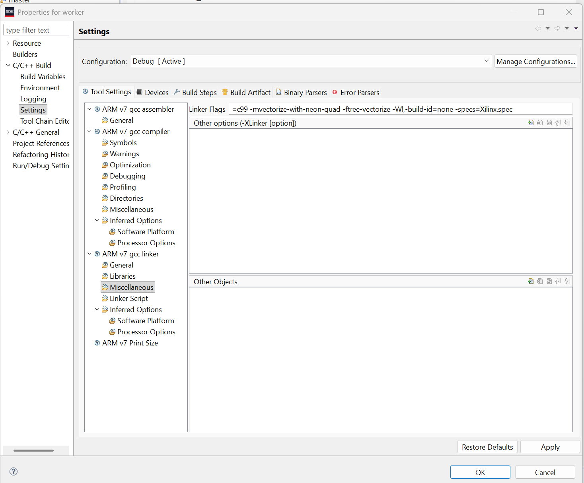
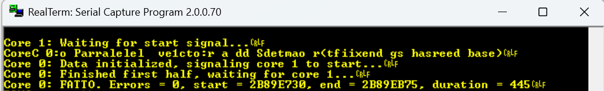
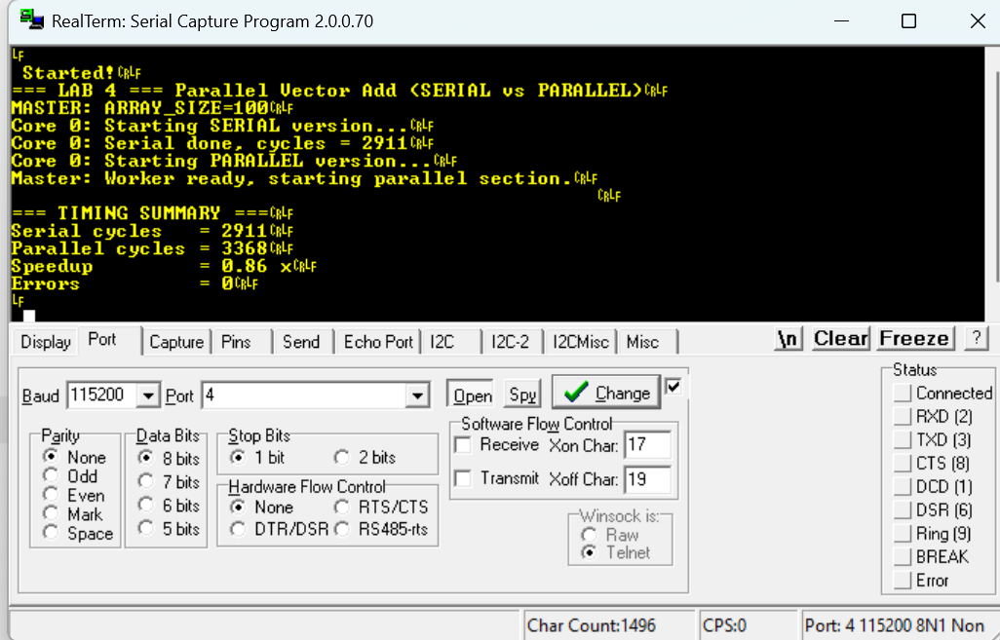
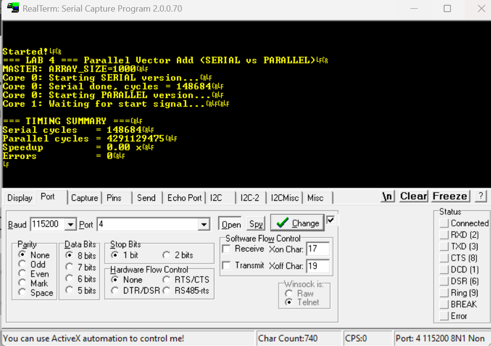
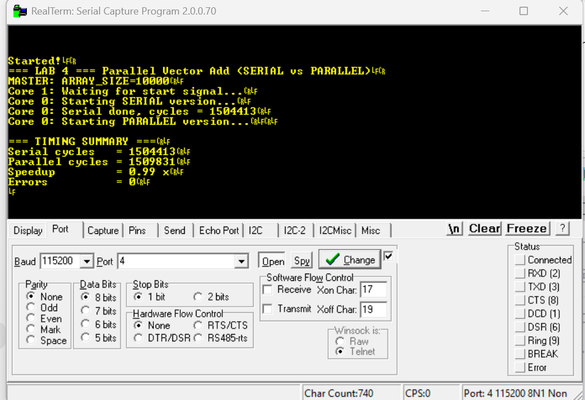
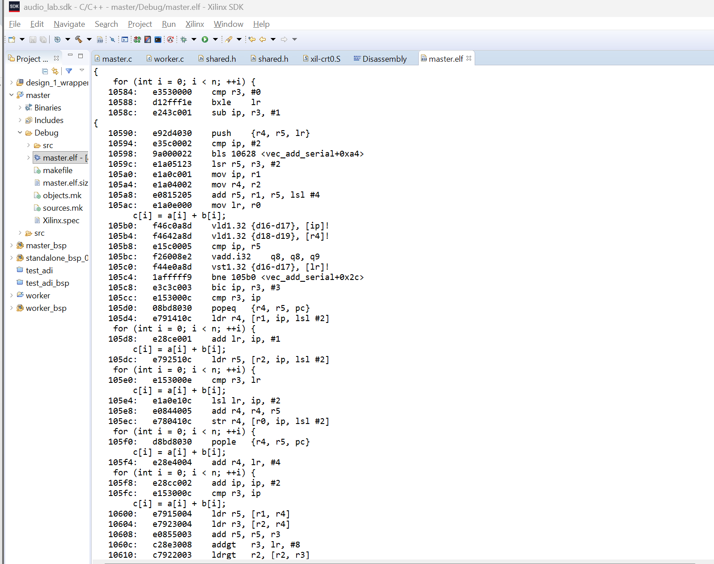

# **Lab 4 – Parallel Processing and SIMD Evaluation**

This repository contains the full implementation of **Lab 4** for the
**Advanced Embedded Systems** course (University of Cagliari).

The project explores **task-level parallelism** on the dual-core ARM Cortex-A9
of the **Zybo Z7** board and **data-level parallelism (SIMD)** through compiler
auto-vectorization using **ARM NEON** instructions.

The application performs vector addition both in **serial** and **parallel**
fashion, measures execution time using the **Global Timer**, and verifies
correctness through result comparison.

---

## **Overview**

This assignment is related to **Lab 4 – Parallel Processing on a Dual-Core System**.

The objective is to implement a **bare-metal shared-memory parallel application**
where:

1. **Core 0 (Master)** and **Core 1 (Worker)** cooperate
2. Two input vectors **A** and **B** are stored in shared DDR memory
3. The result vector **C = A + B** is computed
4. The workload is evenly split:

   * Core 0 computes the first half
   * Core 1 computes the second half
5. Synchronization is achieved through shared flags:
   `start`, `done0`, `done1`
6. Execution time is measured using the **ARM Cortex-A9 Global Timer**
7. A **serial baseline** is executed to evaluate:

   * parallel speedup
   * SIMD auto-vectorization effectiveness

This lab introduces **low-level multi-core coordination**, **shared-memory
synchronization**, and **performance evaluation** without OS support.

---

## **Hardware Platform**

The Vivado hardware platform provides:

| Peripheral         | Function                           |
| ------------------ | ---------------------------------- |
| `ps7_cortexa9_0`   | ARM Core 0 (Master)                |
| `ps7_cortexa9_1`   | ARM Core 1 (Worker)                |
| `ps7_ddr`          | Shared DDR memory                  |
| `ps7_global_timer` | High-resolution timing (≈ 333 MHz) |
| `axi_gpio`         | Button used as execution trigger   |
| `ps7_uart_1`       | UART console output                |

Both cores access the same DDR region, enabling explicit shared-memory
communication.

---

## **Project Structure**

```
Lab4_ParallelProcessing/
│
├── AES/                             → Complete Xilinx SDK workspace
│   ├── master/                      → CPU0 application project
│   ├── worker/                      → CPU1 application project
│   ├── *_bsp/                       → Board Support Packages
│   └── design_1_wrapper_hw_platform → Exported hardware platform
│
├── master.c                         → Core 0: serial + parallel + timing
├── worker.c                         → Core 1: second-half computation
├── shared.h                         → Shared DDR structure and flags
├── main.pdf                         → Experimental result
└── README.md                        → Lab documentation (this file)
```

---

## **Shared Memory Organization**

A fixed DDR address is used for shared data:

```c
#define SHARED_BASE 0x2F100000U
```

Shared structure definition:

```c
typedef struct {
    u32 A[ARRAY_SIZE];
    u32 B[ARRAY_SIZE];
    u32 C[ARRAY_SIZE];

    volatile u32 start;
    volatile u32 done0;
    volatile u32 done1;
} shared_mem_t;
```

Access macro:

```c
#define SHARED ((volatile shared_mem_t *)SHARED_BASE)
```

This region is **explicitly excluded from both linker scripts** to prevent
overlap with `.text`, `.data`, `.bss`, heap, or stack.

---

## **Linker Script Modification**

In accordance with the laboratory instructions, the linker script
(`lscript.ld`) was explicitly modified for both applications to ensure
correct memory mapping in a dual-core shared-memory environment.

In particular, the shared DDR region used for inter-core communication
(starting at address `0x2F100000`) is excluded from all linker-managed
sections, including:

* `.text`
* `.data`
* `.bss`
* heap
* stack

This guarantees that the shared data structure is not overwritten by
either processor and remains accessible to both cores throughout the
execution.

---

<p align="center">
  
</p>
<p align="center"><i>Master linker script (CPU0): all sections placed in ddrCore0, no overlap with shared DDR</i></p>

---

<p align="center">
  
</p>
<p align="center"><i>Worker linker script (CPU1): all sections placed in ddrCore1, no overlap with shared DDR</i></p>

---

These modifications follow the memory layout provided in the laboratory
instructions and are essential to guarantee correct and deterministic
shared-memory behavior.

---


## **Implementation Summary**

### 🔹 **Master – Core 0**

* Disables instruction and data caches
* Initializes vectors **A** and **B**
* Executes **serial vector addition** (baseline)
* Measures serial execution time
* Clears output vector
* Triggers Worker via `start = 1`
* Computes first half of vector **C**
* Waits for `done1`
* Measures parallel execution time
* Computes speedup
* Verifies correctness against serial output

### 🔹 **Worker – Core 1**

* Disables caches
* Waits for button trigger
* Waits for `start == 1`
* Computes second half of vector **C**
* Sets `done1 = 1`
* Enters idle loop

---

## **Serial Baseline (SIMD-Vectorized)**

The following serial reference function is executed on Core 0:

```c
void vec_add_serial(u32 * restrict c,
                    const u32 * restrict a,
                    const u32 * restrict b,
                    int n)
{
    for (int i = 0; i < n; ++i) {
        c[i] = a[i] + b[i];
    }
}
```

When compiled with NEON-enabled optimization flags, this loop is
**automatically vectorized** by the compiler.


---

## **Compilation Settings**

Both **master** and **worker** projects are compiled with aggressive
optimization and SIMD auto-vectorization enabled to exploit ARM NEON
instructions.

### **Compiler Flags**

```

-c -fmessage-length=0 -MT"$@" -mcpu=cortex-a9 -mfpu=neon -mfloat-abi=hard -std=c99 -mvectorize-with-neon-quad -ftree-vectorize -fopt-info-vec-optimized -fopt-info-vec-missed -ffast-math
```

<p align="center">
  
</p>
<p align="center"><i>Compiler optimization flags for the Master application</i></p>

---

<p align="center">
  
</p>
<p align="center"><i>Compiler optimization flags for the Worker application</i></p>

---

### **Linker Flags**

```

-mcpu=cortex-a9 -mfpu=neon -mfloat-abi=hard -std=c99 -mvectorize-with-neon-quad -ftree-vectorize -Wl,-build-id=none -specs=Xilinx.spec 
```

<p align="center">
  
</p>
<p align="center"><i>Linker configuration for the Master application</i></p>

---

<p align="center">
  
</p>
<p align="center"><i>Linker configuration for the Worker application</i></p>

---


## **System Debugger Configuration**

A **System Debugger** run configuration is used.

### **Target Setup**

✔ Reset entire system
✔ Program FPGA
✔ Run `ps7_init`
✔ Run `ps7_post_config`

### **Application Assignment**

| Processor | ELF file     |
| --------- | ------------ |
| CPU0      | `master.elf` |
| CPU1      | `worker.elf` |

Disabled options:

- Reset processor
- Stop at program entry

This ensures both cores start simultaneously and correctly.

---

## **Execution Time Measurement**

Timing is performed using the **Global Timer**:

```c
t_start = Xil_In32(GLOBAL_TMR_BASEADDR + GTIMER_COUNTER_LOWER_OFFSET);
t_end   = Xil_In32(GLOBAL_TMR_BASEADDR + GTIMER_COUNTER_LOWER_OFFSET);
```

Timer frequency:

```
Global Timer ≈ 333 MHz
```

Measured values:

* Serial execution cycles
* Parallel execution cycles
* Speedup factor

Measurements are repeated for:

```
ARRAY_SIZE = 100
ARRAY_SIZE = 1000
ARRAY_SIZE = 10000
```


## **Output Example**

---
<p align="center">
  
</p>
<p align="center"><i>Output produced by both cores running in parallel (Master + Worker)</i></p>

---

---
<p align="center">
  
</p>
<p align="center"><i>Output produced by both cores running in parallel (Master + Worker)</i></p>

---
---
<p align="center">
  
</p>
<p align="center"><i>Output produced by both cores running in parallel (Master + Worker)</i></p>

---
---
<p align="center">
  
</p>
<p align="center"><i>Output produced by both cores running in parallel (Master + Worker)</i></p>

---


---

## **Observed Results**

* Parallel execution does **not provide significant speedup**
* The workload is **memory-bound**
* Both cores contend for the same DDR bandwidth
* Synchronization overhead is minimal and explains this behavior.

This behavior is expected on shared-memory systems without private caches.

## **Brief Results Summary**

Execution time measurements were performed for different array sizes
(`ARRAY_SIZE = 100`, `1000`, `10000`) using the ARM Cortex-A9 Global Timer.

The experimental results show that parallel execution on two cores does not
provide a significant speedup compared to the serial implementation.
This behavior is expected, since the vector addition workload is
**memory-bound** and both cores access the same shared DDR memory, leading
to bandwidth contention.

SIMD auto-vectorization using ARM NEON instructions was successfully
applied to the serial baseline, as verified in the assembly output.
However, while SIMD improves instruction-level parallelism, it does not
overcome the memory bandwidth limitation of the system.


---
## **Assembly Inspection (SIMD Verification)**

The compiled `master.elf` file was inspected using the SDK disassembly view
to verify the effectiveness of compiler auto-vectorization.

The serial baseline function (`vec_add_serial`) shows the presence of
**ARM NEON SIMD instructions**, including:

* `vld1.32` – vector load
* `vadd.i32` – vector addition
* `vst1.32` – vector store

These instructions confirm that the compiler successfully applied
**data-level parallelism** through NEON vectorization to the serial loop.

<p align="center">
  
</p>
<p align="center"><i>Disassembly view of <code>master.elf</code> highlighting NEON SIMD instructions</i></p>

---


## **Notes**

* Instruction and data caches are disabled to avoid coherency issues
* Shared DDR address must not overlap linker-managed regions
* Synchronization is implemented via busy-wait flags
* Button GPIO ensures controlled experiment start
* UART output is kept outside timing-critical sections

---

*Developed by Lello Molinario*


