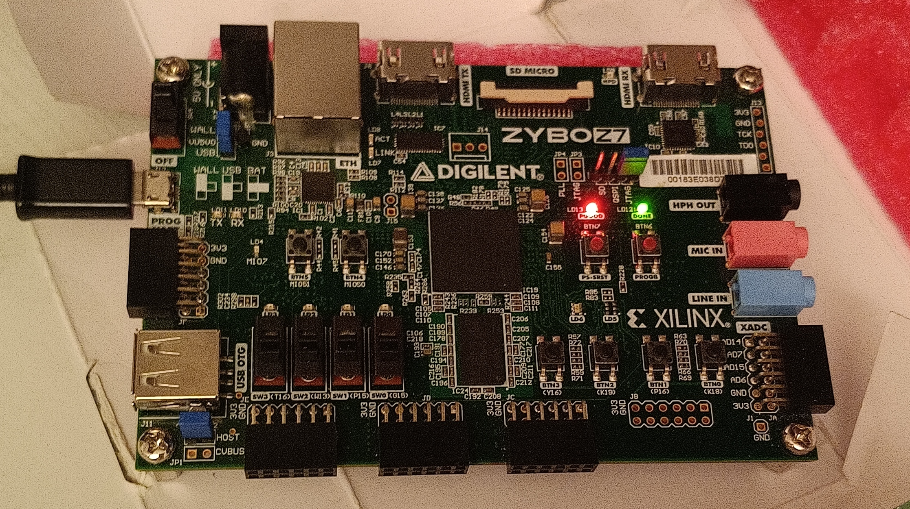

# AES Labs – Advanced Embedded Systems


**Course:** Advanced Embedded Systems (University of Cagliari – A.Y. 2025)

**Instructor:** Prof. Paolo Meloni

**Board:** Digilent Zybo Z7 

**Language:** C

---

## 📘 Overview

This repository contains all laboratory assignments developed for the **Advanced Embedded Systems** course at the *University of Cagliari*.
Each lab focuses on hands-on embedded programming for the **MicroBlaze soft-core processor** implemented on the **Zybo Z7 FPGA board**, with emphasis on real hardware control, AXI peripherals, and interrupt handling.

---

### 📸 Zybo Z7 Development Board 

<p align="center">
  
</p>

*Photo taken during AES Lab*

---

## 🧩 Labs Summary

| Lab       | Title                    | Description                                                                                                                                                                                                                                                                  |
| --------- | ------------------------ | ---------------------------------------------------------------------------------------------------------------------------------------------------------------------------------------------------------------------------------------------------------------------------- |
| **Lab 1** | **Polling & Interrupts** | (a) `a_lab1_polling_basic.c` – polling version (read switches and mirror on LEDs) <br> (b) `b_lab1_interrupt_part1.c` – dual interrupt (SW + BTN) via AXI Interrupt Controller <br> (c) `c_lab1_interrupt_part2.c` – extended ISR: add Student ID digit (9) + invert pattern |

---

##  Repository Structure

```
AES Labs/
│
│── img/    → images
│ 
├── Lab 1/
│   ├── a_lab1_polling_basic.c
│   ├── b_lab1_interrupt_part1.c
│   ├── c_lab1_interrupt_part2.c
│   ├── AES/                     → Full Xilinx SDK 2019.1 workspace
│   └── README.md                → Lab 1 documentation
│
└── README.md                    → Root documentation (this file)
```

---


*Developed and maintained by Lello Molinario*

